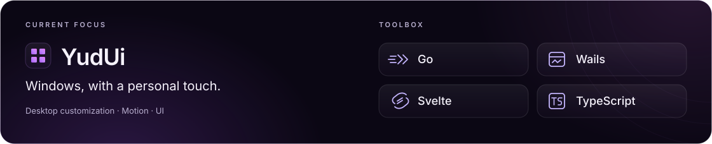

  <picture>
    <source media="(max-width: 767px)" srcset="assets/hero-mobile.svg" />
    
  </picture>

        https://yudui.dev/ \n
  I build tools that make a workspace feel personal — from desktop interfaces to AI integrations.

  <picture>
    <source media="(max-width: 767px)" srcset="assets/workbench-mobile.svg" />
    
  </picture>

  <picture>
    <source media="(max-width: 767px)" srcset="assets/github-mixer-mobile.svg" />
    
  </picture>

  <a href="https://matyankass.github.io/MatyanKass/">
    <picture>
      <source media="(max-width: 767px)" srcset="assets/contribution-invaders-mobile.svg" />
      
    </picture>
  </a>

  <a href="https://matyankass.github.io/MatyanKass/"><b>Play Contribution Invaders ↗</b></a> 
  Public GitHub data · refreshed every 6 hours · language shares by code bytes in owned, non-fork public repositories

<!-- RECENT-WORK:START -->

  <b>Recent public work</b> 
  <a href="https://github.com/MatyanKass/claude-web-api-deepseek">claude-web-api-deepseek</a> — DeepSeek Web provider work based on beekamai/claude-web-api 

<!-- RECENT-WORK:END -->

  <a href="https://github.com/MatyanKass?tab=repositories">Explore my repositories ↗</a>

